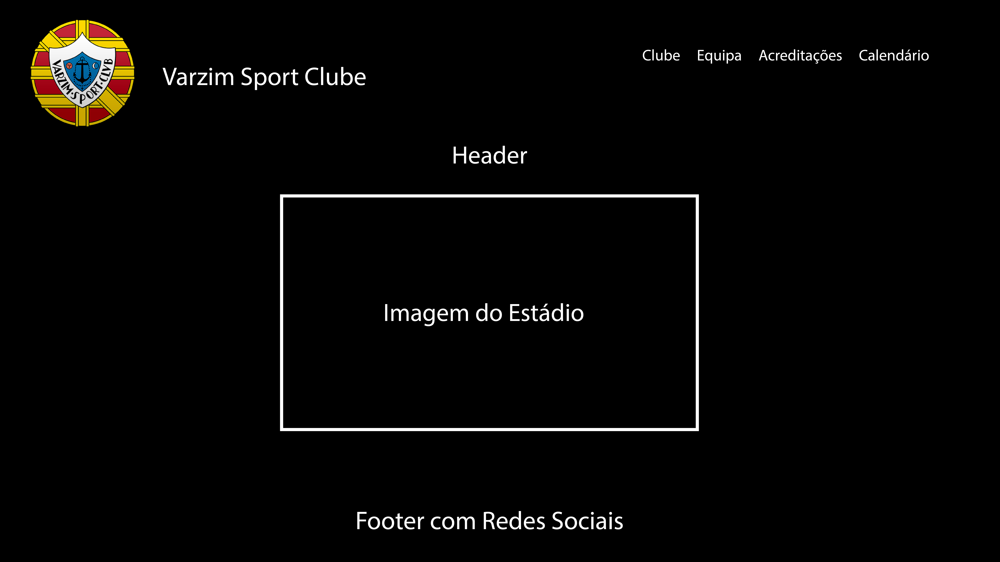
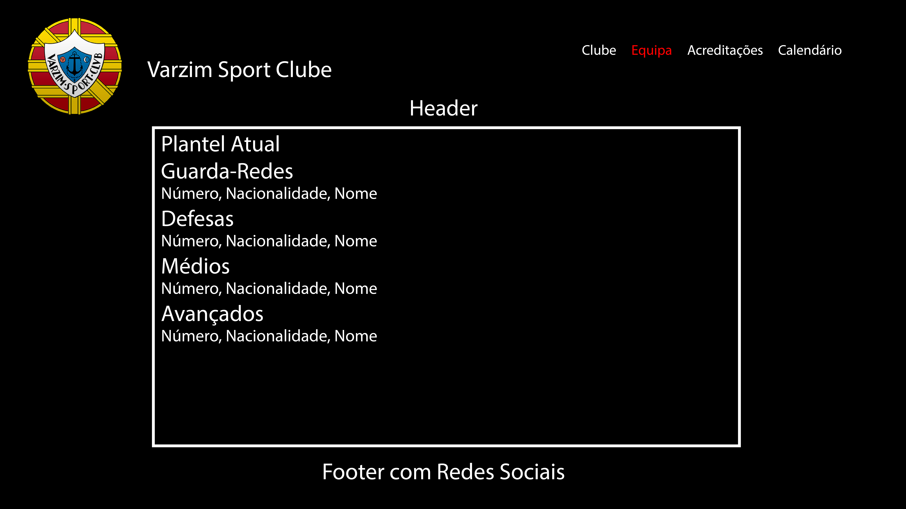
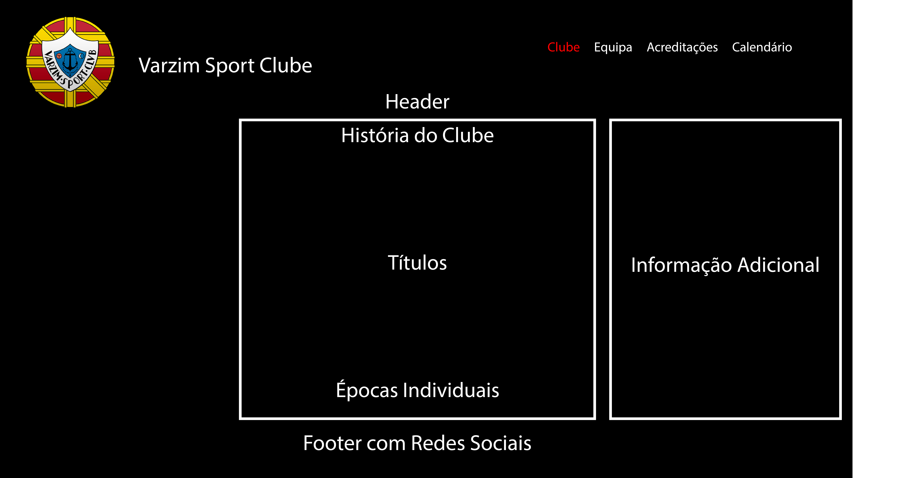
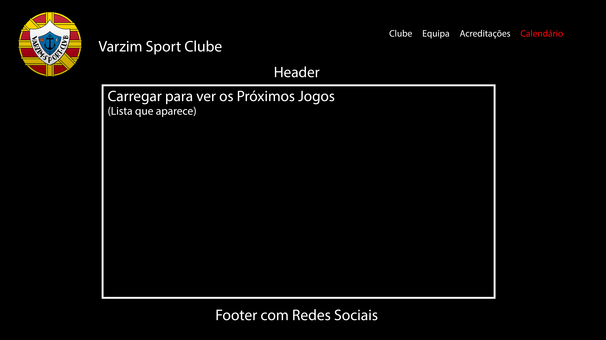
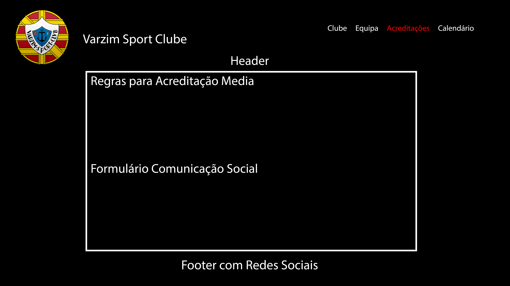
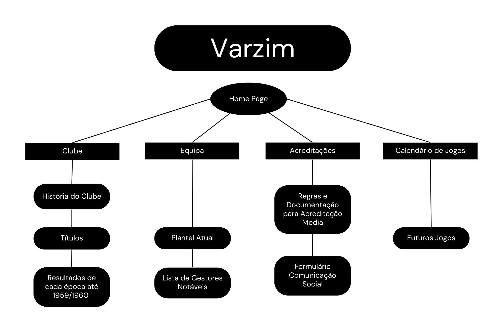
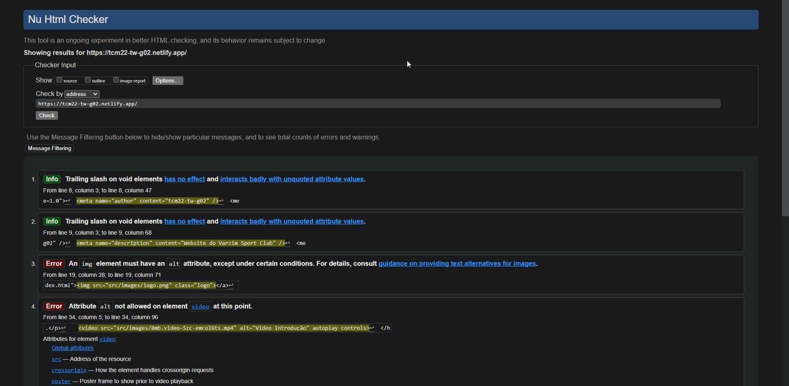
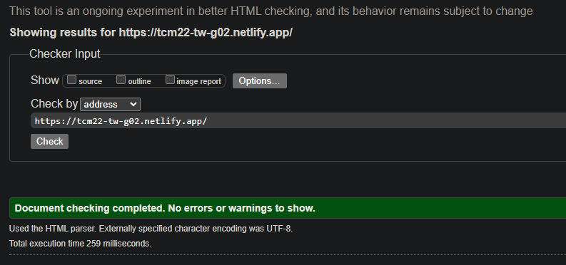

# Relatório

## Apresentação do projeto

A nossa ideia é de construir a presença online de um clube de futebol, sendo este o Varzim, esta escolha deve-se ao facto de um dos integrantes do nosso grupo, Vitor Marques, ser da Póvoa do Varzim e ser o clube da sua terra.. O clube da Póvoa de Varzim, é um clube de futebol que não tem uma presença online muito forte e como tal, queremos enbarcar nesse desafio. As nossas ideias, é a de construir um site que um fã do clube, consiga receber o melhor da informação sobre o clube, de uma forma prática e num só espaço. Tencionamos ter noticias sobre o clube, datas de futuros jogos e também informação dos devidos jogadores.
Visto que o website oficial do clube não é tão bem explorado como de clubes doutras dimensões decidimos embarcar neste desafio, no nosso website temos várias páginas.

## User Interface

### Esboços

### Sitemap

## Produto

### Descrição do produto

O nosso website é constituído por 5 páginas. A página iniciai têm um vídeo para mostrar um pouco daquilo que é o Varzim SC e mostrar também um pouco daquilo que os adeptos sentem pelo clube. A 2.ª página é toda ela dedicada ao clube, nesta página o maior foco é na história, desde a história do clube até ao histórico de troféus, e tentamos replicar uma tabela lateral à semelhança da Wikipédia. 
A 3.ª página é dedica à equipa, onde exibimos todos os jogadores atuais que integram o plantel, e fazemos uma referência a todos os treinadores e presidentes que passaram pelo clube. A 4ª página é toda ela referente a acreditações, contendo as regras e documentação necessária para obter a acreditação e também têm formulário feito por HTML e o Java script utilizado para confirmar e enviar o formulário
Por fim na 4.ª página, que é dedicada para os próximos jogos, onde através do click no botão “Carregar Jogos” temos acesso aos próximos jogos do Varzim SC, conforme o XML.

### Instruções de instalação e configuração

Em relação ao nosso website, não têm qualquer tipo de conteudo que seja necessário o seu download.

### Regras de utilização

No nosso website não há autenticação, no que toca à acessibilidade nós criamos um website no qual a navegação pode ser feita através do teclado sem necessitar obrigatoriamente do uso do "mouse".

### Ajuda à navegação

Relativamente à navegação, cada página quando é selecionada apresenta uma cor diferente da inicial quando ainda não havia sido selecionada. Já referido anteriormente, o nosso website é compatível com uma navegação sem a utilização obrigatória do "mouse". 

### Validações de formulários

Todos os dados preenchidos nos formulários são guardados numa base de dados, que pode ser consultado posteriormente.

### Validação do HTML e CSS

O HTML e o CSS foram testados através do validador da W3school. 

#### Comprovativos da valição do HTML e CSS

**Index.html**

Antes 

Depois

### Detalhes de implementação

No que toca à implementação cumprimos com todos os objetivos pedidos no enunciado, com pelo menos um exemplo.

## Apresentação

Para a nossa apresentação não ser uma apresentação que se limita à leitura, decidimos fazer algo mais atrativo, primeiramente com a aprensentação de um Power Point, que posteriormente irá ser complementado através da gravação de um video.

[LinkDoVideo](https://vimeo.com/790600565) 